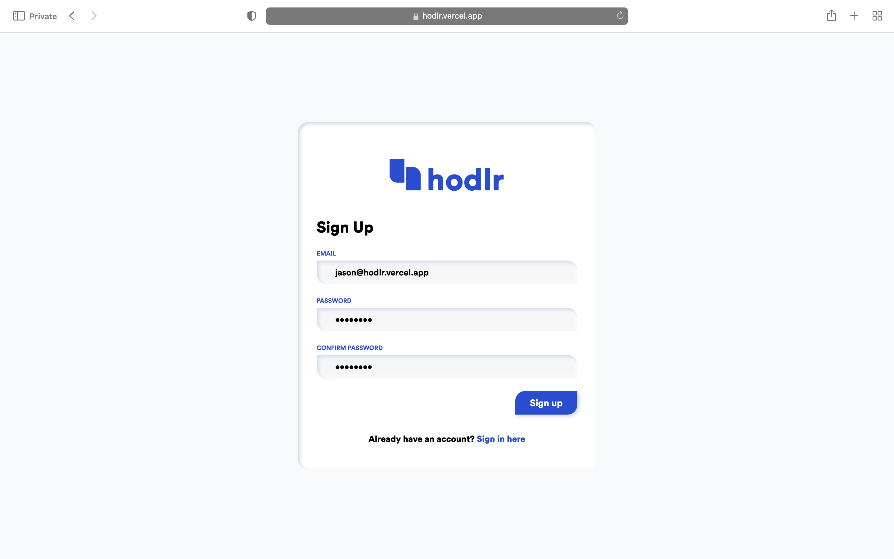
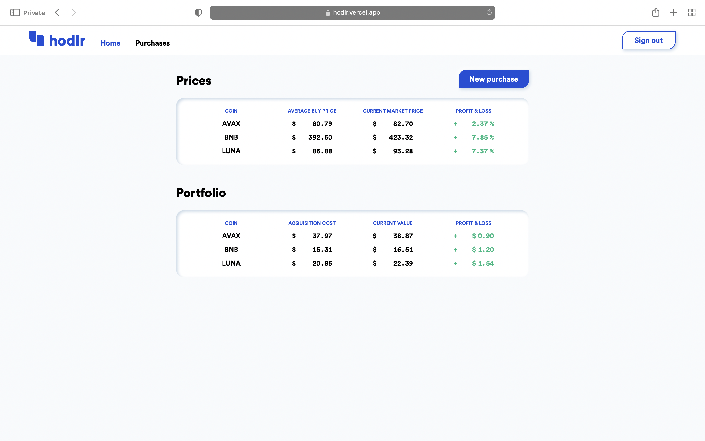
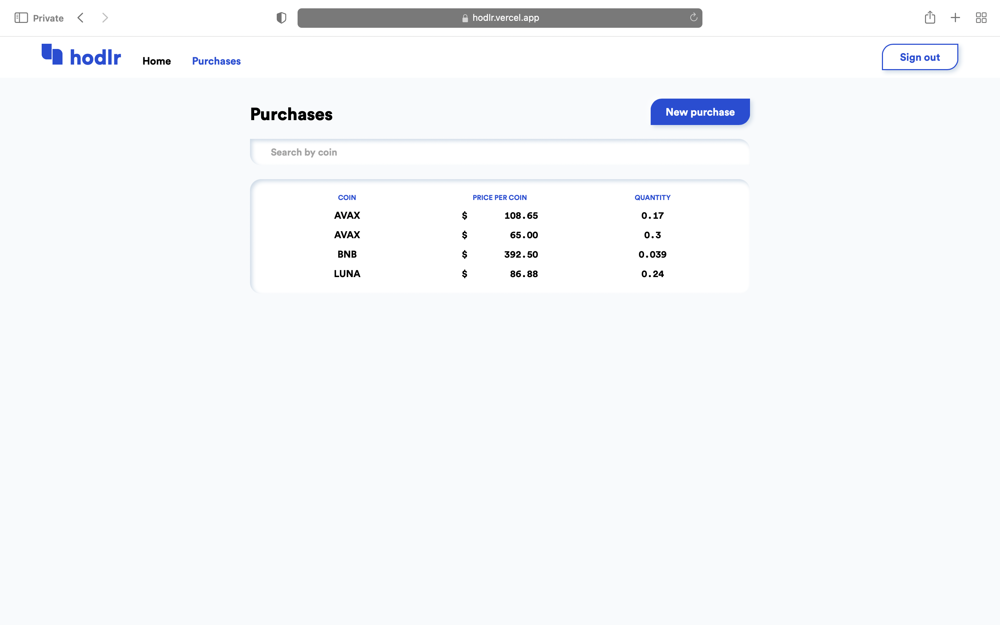
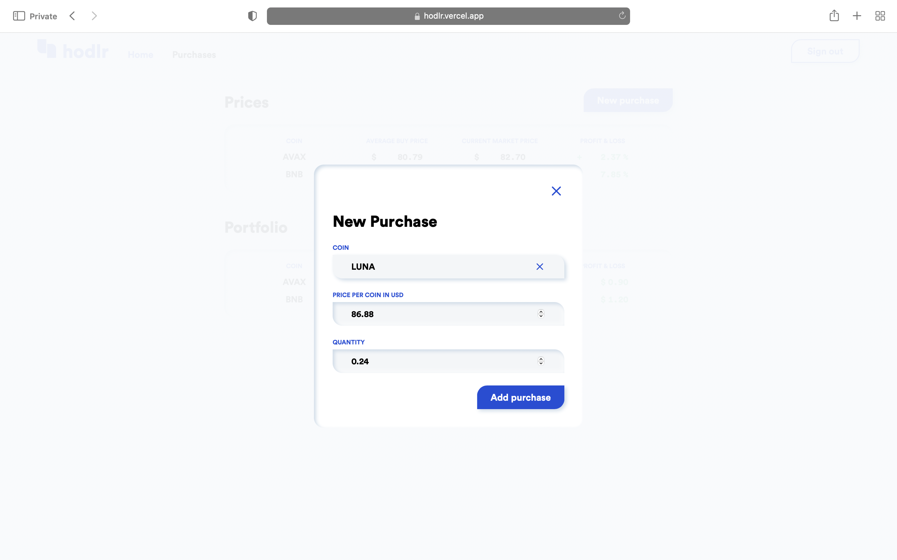

# hodlr frontend

## Background

This is the repository for a react app that serves as the frontend for hodlr

hodlr is an app I built to automate the manual process I used to track crypto prices against my average buying price. While the average buying price and acquisition cost calculations could be automated with Google Sheets or Excel formulas, I had to manually update the coin prices every day by copying and pasting the prices. I built hodlr so I would no longer have to do that. hodlr is able to automate not only the calculations, but the current price updates as well.

## Installation and Setup

```console
git clone git@github.com:jason-nn/batch14-final-frontend.git
```

```console
cd batch14-final-frontend
```

```console
npm install
```

```console
npm start
```

## Screenshots








